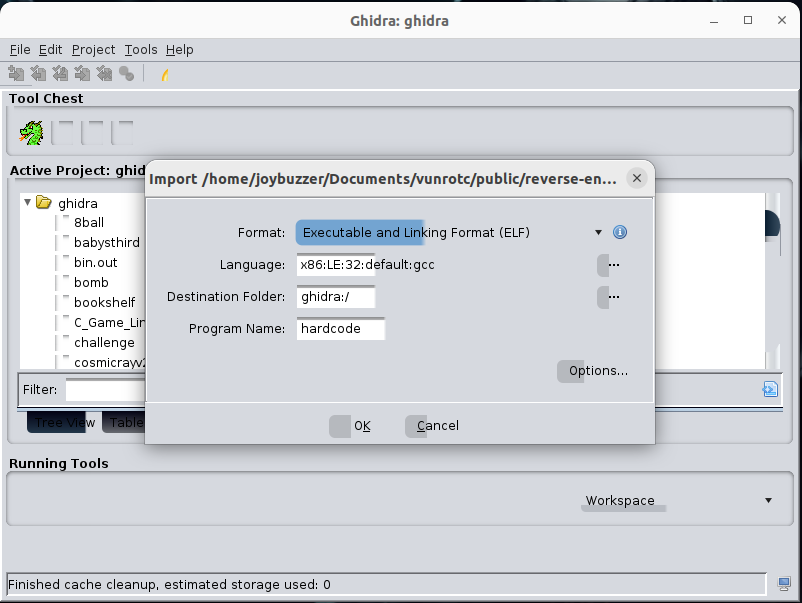
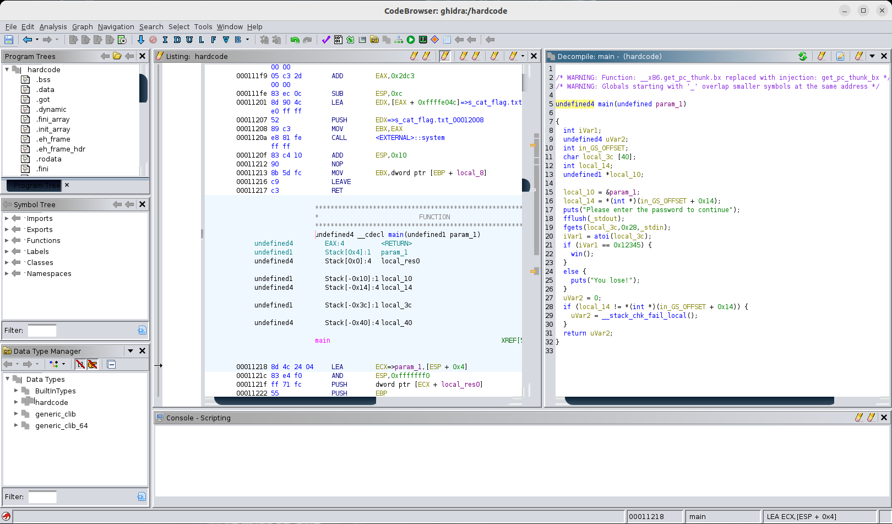

# 0xB: Ghidra

This section will cover Ghidra, a reverse engineering tool developed by the NSA. Ghidra is a powerful tool that can be used to reverse engineer binaries. This is converting the assembly code into a higher-level language like C.

Ghidra also helps us to find global values like hardcoded strings and variables.

The same process we did in the binex section can be done automatically in Ghidra. _So, why did I make you do it?_ Because I want you to understand the theory behind why the exploits work. Many students use Ghidra as a crutch rather than a tool and don't understand the underlying processes. Ghidra makes hiding the exploit's details easy, especially the stack frame's layout.

I often find myself neglecting Ghidra during binex challenges because it is easier to visualize the stack frame using `gdb`. Ghidra **does not** offer dynamic analysis, which is only good for static analysis. I often use Ghidra to check my work, find hardcoded values, and verify the program's control flow.

### Installing Ghidra

I use an Ubuntu Linux virtual machine to run Ghidra. Ghidra is not installed by default, and I dislike the `snap` package manager. Here are the steps to downloading and installing Ghidra by hand:

* Go to the Ghidra releases page: [https://github.com/NationalSecurityAgency/ghidra/releases](https://github.com/NationalSecurityAgency/ghidra/releases)
* Download the latest release or a version of your choice. As of writing this, I am using Version 10.3.1. _**Note**: Ghidra will not auto-update with this download method, meaning that updates must be done manually._
* Unzip the folder using `unzip filename.zip`.
* The binary to run Ghidra is located in the `ghidra_<version-num>` folder. The binary is called `./ghidraRun`.
* Rather than navigating to this folder every time, I made a shell file that runs it automatically. Simply add the file path into a file called `.ghidra` in your home or root directory. Mine looks like:

```nasm
$ cat /.ghidra
/home/joybuzzer/Downloads/ghidra_10.3.1_PUBLIC/ghidraRun
```

Then, mark the file executable using `chmod +x /.ghidra`. Now, you can run Ghidra by simply typing `/.ghidra` from anywhere in the terminal.

### How to Use Ghidra

I will cover the basics of how to use Ghidra in this section. I know I do not use Ghidra to its full potential, but I will cover the basics. I recommend the official [Ghidra Cheat Sheet](https://ghidra-sre.org/CheatSheet.html) if you want to learn more.

After opening Ghidra, create a new project. _This is bad practice_, but I use the same project for all my binaries. You can make a new project for each challenge you work on. I use Ghidra primarily for CTF occasions, which only involves dissecting individual binaries independent of each other. If you are working on a large project, you may want to create a new project for each challenge.

Once a project is made, import a project using `I` (or the import button). When you add a project, Ghidra will automatically identify the architecture and endian-ness of the binary.

<div align="center">



</div>

Now that the binary is imported, you can open it by double-clicking on the binary in the project explorer. This will open the binary in the CodeBrowser. When prompted, you should choose to analyze the binary. The default settings are fine for most binaries. Once the binary is analyzed, you will see the decompiled C code in the main window.

<div align="center">



</div>

We notice the decompilation window on the right side. The binary is ready for analysis! We'll uncover more of what you can do with each binary using Ghidra.

### What Ghidra Can't Do

Ghidra is a powerful tool, but it is not a silver bullet. Ghidra is not a debugger, so it cannot be used to analyze a binary dynamically. This means that Ghidra cannot be used to find the value of a variable at a certain point in the program. Ghidra is a static analysis tool, meaning it can only analyze the binary as a whole.

Ghidra is not great at understanding loaded values on the stack. It will often flood the decompilation window with single variables with values rather than an array of values.

Ghidra typically names the variables based on their location in the stack. For example, `local_3c` will be stored at `ebp-0x3c`. We can use this to help reassemble arrays and data structures ourselves.
