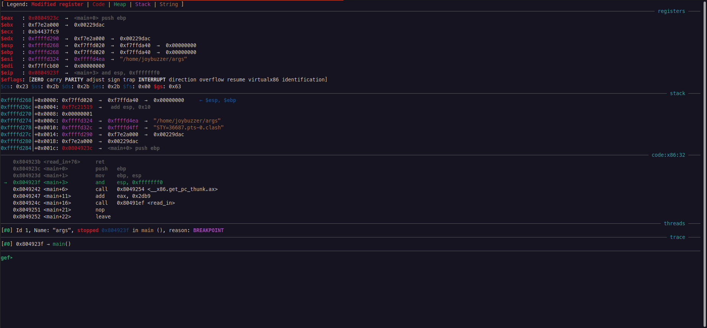
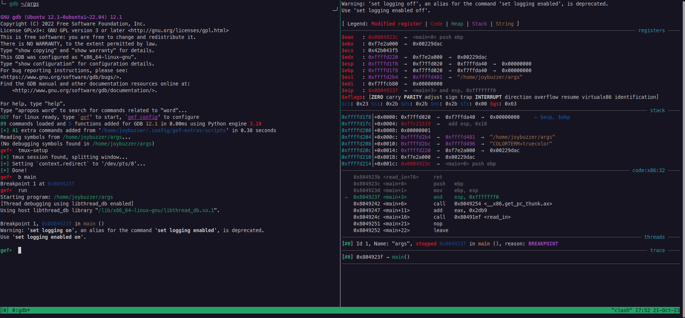

# Debugging UI

These commands are used to control GEF's interface.

## `context`

The context is the heart of GEF. It provides the state of the registers, stack, instruction pointer, threads, and stack trace. The context loads and updates automatically as you run the program.

This is what the `context` pane looks like:

<div align="center">



</div>

Use `context` to refresh the context. This prints the current context. This is useful if you have printed other data and want to re-see the context.

You can use `gef config context.layout` to change the layout of the context. By default, all sections are shown.

```nasm
gef➤  gef config context.layout
─────────────────────────────────── GEF configuration setting: context.layout ───────────────────────────────────
context.layout (str) = "legend regs stack code args source memory threads trace extra libc_function_args syscall_args libc_function_args syscall_args libc_function_args syscall_args"

Description:
        Change the order/presence of the context sections
```

To hide a section, prepend the section name with a `-` (or omit it).

```nasm
gef➤ gef config context.layout "-legend regs stack code args -source -threads -trace extra memory"
```


This configuration will not display the `legend`, `source`, `threads`, and `trace` sections.


The following are also customizable:

* `nb_lines_stack`: The number of lines of the stack to show.
* `nb_lines_backtrace`: The number of lines of the backtrace to show.
* `nb_lines_code` and `nb_lines_code_prev`: The number of lines of code to show before and after the current instruction.
* `context.nb_lines_threads`: The number of lines of the threads to show.

Finally, you can change the direction that the stack grows using:

```nasm
gef➤ gef config context.grow_stack_down True
```


This configuration will display the stack with the largest addresses at the top.


## `tmux-setup`

To make GEF's output more readable, you can use the `tmux-setup` command to format the GEF window inside `tmux`. This will split the plane vertically and place the context in the right-hand pane.

<div align="center">



</div>

As you enter commands on the left side, the context will update on the right.
