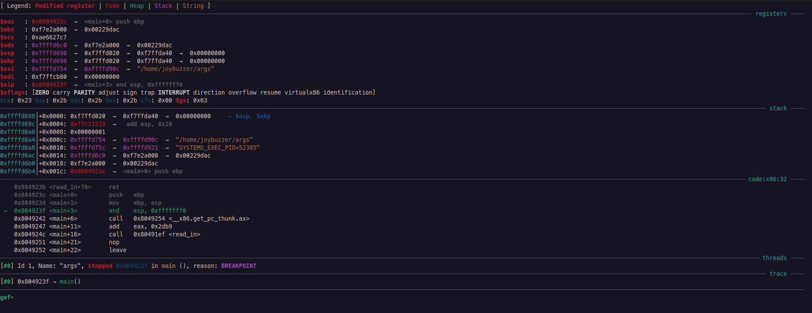
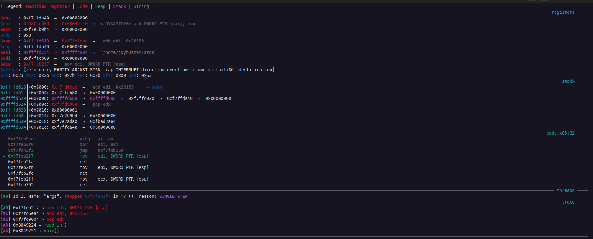

# Stepping and Continuing

This section is known as **dynamic analysis**. Dynamic analysis is actively running the binary and observing its behavior. This is done by watching the registers, the stack, and the instructions as they are executed.

## Using Breakpoints

Breakpoints are how we can pause execution to analyze the binary. We can set a breakpoint using the `break` command (`b` for short). It takes a secondary argument of the address to break at. You have to dereference the address; otherwise, `gdb` will assume you are attempting to name a function.

```nasm
gef➤  b *0x0804923c
Breakpoint 1 at 0x804923c
```

Moreover, we can also set breakpoints at the start of specific functions:

```nasm
gef➤  b read_in
Breakpoint 2 at 0x80491f3
```

Or a function plus an offset. Since a function plus an offset returns an address, we must dereference it.

```nasm
gef➤  b *(win+38)
Breakpoint 3 at 0x80491cc
```

### The Breakpoint List

You can use `info breakpoints` (`info break` for short) to see the current breakpoints set.

```nasm
gef➤  info break
Num     Type           Disp Enb Address    What
1       breakpoint     keep y   0x0804923f <main+3>
2       breakpoint     keep y   0x080491f3 <read_in+4>
3       breakpoint     keep y   0x080491cc <win+38>
```

We need this menu to get the breakpoint number for each breakpoint. We use this to disable or delete breakpoints.

#### Disabling Breakpoints

We can enable or disable breakpoints based on their number. This is useful to temporarily disable a breakpoint without deleting it.

```nasm
gef➤  disable 2
gef➤  enable 2
```


Breakpoints are _**enabled**_ by default.


#### Deleting Breakpoints

We can use this menu to delete breakpoints by their number. We can use `delete` (or `d` for short).

```nasm
gef➤  d 3
```

## Setting Watchpoints

A **watchpoint** is a breakpoint triggered when a specific memory address is accessed. This is useful for debugging when a specific memory address is accessed.

You can set a watchpoint to watch a register:

```nasm
gef➤  watch $esp
Watchpoint 2: $esp
```

You can also watch an instruction or a hardcoded location:

```nasm
gef➤  watch *(read_in+59)
Hardware watchpoint 3: *(read_in+59)
```

### The Watchpoint List

You can use `info watchpoints` (`info watch` for short) to see the current watchpoints set.

```nasm
gef➤  info watch
Num     Type           Disp Enb Address    What
2       watchpoint     keep y              $esp
3       hw watchpoint  keep y              *(read_in+59)
```

## Running the Binary

You can run the binary using the `run` command (`r` for short). Without any breakpoints set, this doesn't do much:

```nasm
gef➤  r
Starting program: /home/joybuzzer/args 
[Thread debugging using libthread_db enabled]
Using host libthread_db library "/lib/x86_64-linux-gnu/libthread_db.so.1".
Good luck winning here!
ok
[Inferior 1 (process 79132) exited with code 0130]
```

However, if we set a breakpoint, we can see the binary pause at the breakpoint:

<div align="center">



</div>


This output is displayed because we installed GEF. If you did not install GEF, this output does not preview at runtime. This is one of the major benefits of GEF and why I recommend it.


The binary is now running. GEF provides us with information on the essential registers, the stack frame, the instruction set, and the call stack.

## Stepping

There are two kinds of steps when using a debugger: _stepping in_ and _stepping over_.

* **Step In**: This method steps into any called functions and pauses at the first instruction. This allows you to walk through called functions.
* **Step Over**: This method steps over a function and immediately executes all its contents. This is useful for library functions where their instructions aren't important.

To step in, use the `si` instruction. To step over, use the `ni` instruction. You can use `ni <num>` (or `si <num>`) to step that many instructions. `gdb` also remembers your most recent instruction, so pressing Enter will repeat your last instruction.

For the current binary, running the following will get us into `read_in`:

```nasm
gef➤  ni
gef➤  
gef➤  
gef➤  si
```

## Continuing

You can use the `continue` command (`c` for short) to continue execution until the next breakpoint or watchpoint is hit.

```nasm
gef➤  c
Continuing.
```

You can use the `finish` command to continue running until the current function returns.

```nasm
gef➤  finish
```

The `until` (`u` for short) command continues execution until _the program counter is greater than the jump address_. This is useful for stepping over loops.

```nasm
gef➤  u
```

The `advance` function continues running until a specified location. This is the same as using a breakpoint without having to permanently set a breakpoint.

```nasm
gef➤  advance 0x804923c
```

## Stack Traces

A **stack trace** is a list of all the functions that have been called up to this point. This is useful for debugging and understanding the flow of the program.

To view the stack trace, use the `backtrace` command (`bt` for short).

```nasm
gef➤  bt
#0  0xf7feb2f7 in ?? () from /lib/ld-linux.so.2
#1  0xf7fd6ead in ?? () from /lib/ld-linux.so.2
#2  0xf7fd9004 in ?? () from /lib/ld-linux.so.2
#3  0x08049224 in read_in ()
#4  0x08049251 in main ()
```


I stepped into a random location to show many stack frames. This comes from an STL function calling other STL functions inside the `ld` file.


GEF also previews this stack trace:

<div align="center">



</div>

### Moving Up and Down the Stack

You can use `up` and `down` to move up and down the stack trace. This is useful for viewing the contents of the stack frame. These take optional arguments of how many frames to move up or down.

```nasm
gef➤  up 2
#2  0xf7fd9004 in ?? () from /lib/ld-linux.so.2
```

## Running Backwards

You can run programs in reverse order to better understand how to reach a certain location in a binary. Stepping backward works slightly differently than stepping forward.

Use `reverse-stepi` (`rsi` for short) to reverse-executive one machine instruction. This is the same as stepping backward (and in).

```nasm
gef➤  rsi
```

Use `reverse-nexti` (`rni` for short) to reverse-executive a single instruction in reverse. _Called functions are un-executed automatically._

```nasm
gef➤  rni
```

`reverse-continue` (`rc` for short) will continue execution in reverse until the next breakpoint or watchpoint is hit.

```nasm
gef➤  rc
```

`reverse-finish` takes you to where the current function was called (the top of the function).

```nasm
gef➤  rf
```

## Debugging Forks

`gdb` must be instructed on how to follow forks. Since a fork creates a separate process, you must tell `gdb` how to respond.

Use `set follow-fork-mode` to set how you want to follow. You can choose to follow the `parent` or the `child`.

```nasm
gef➤  set follow-fork-mode parent
```

Use `show follow-fork-mode` to show the active mode.

```nasm
gef➤  show follow-fork-mode
Debugger response to a program call of fork or vfork is "parent".
```

`gdb` can also detach a process after a fork to retain debugger control over both. The mode can be `on` (the `follow-fork-mode` process will be detached and will run independently) or `off` (both processes are held under `gdb`, one suspended while debugging the other).

```nasm
gef➤  set detach-on-fork on
```

Again, `show detach-on-fork` shows the current mode.

```nasm
gef➤  show detach-on-fork
Whether gdb will detach the child of a fork is on.
```

Finally, `follow-exec-mode` sets the debugger's response to an `exec` call. The mode can be `new` (`gdb` creates an inferior process and rebinds to it) or `same` (`gdb` continues to debug the same process).

```nasm
gef➤  set follow-exec-mode new
```

`show follow-exec-mode` shows the current mode.

```nasm
gef➤  show follow-exec-mode
Follow exec mode is "new".
```
